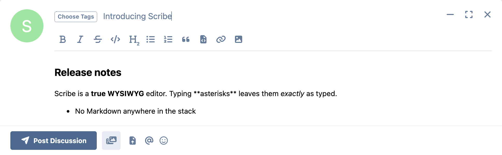
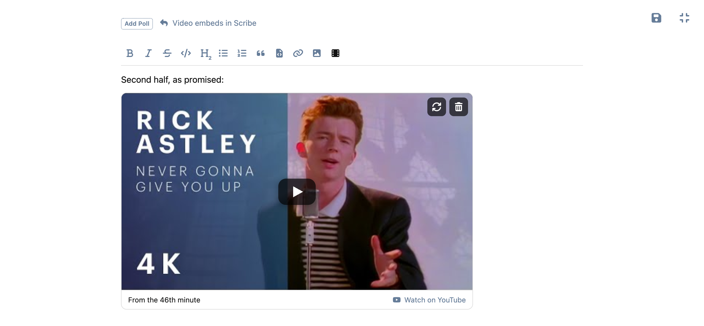
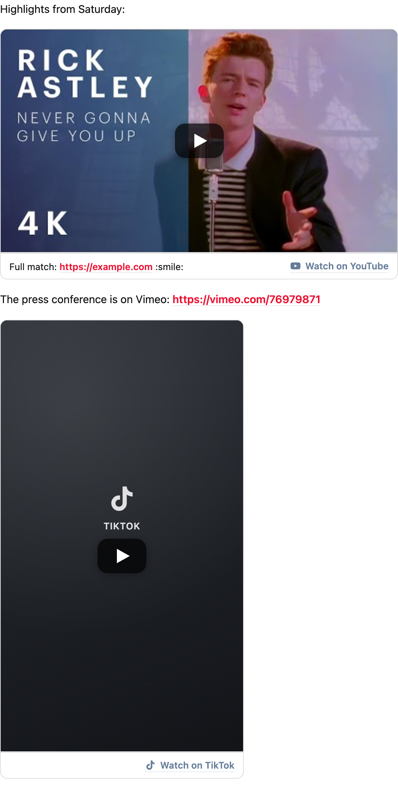
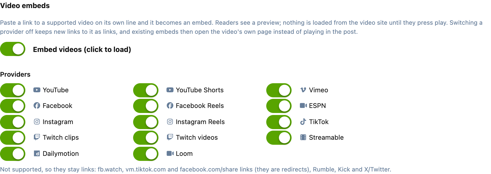
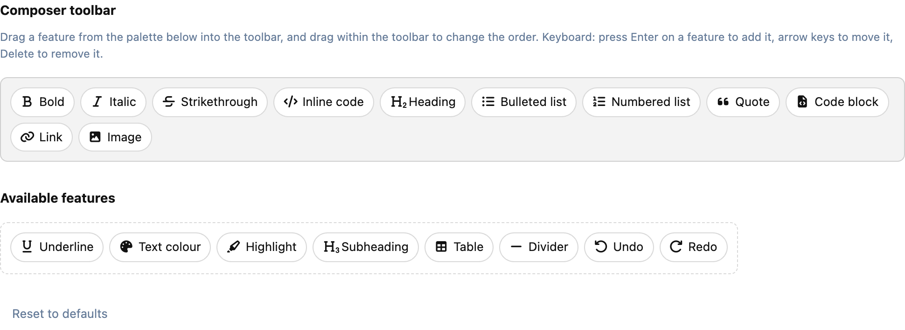

# Scribe

A true WYSIWYG editor for Flarum 2 — TipTap, with **no Markdown anywhere in the stack**.

Both `flarum/markdown` and `fof/rich-text` can be uninstalled. Existing posts keep
rendering exactly as they did, with no migration and no rewritten rows.



## Why this exists

Every WYSIWYG editor for Flarum so far has been a rich editor sitting *on top of*
Markdown: the document is serialised to Markdown on submit and re-parsed on load.
That is why `flarum/markdown` is a hard dependency of `fof/rich-text`, and why
Markdown syntax keeps leaking into a supposedly what-you-see-is-what-you-get
experience — type `**bold**` and it turns bold, paste code with underscores and it
turns italic.

Scribe removes the Markdown layer entirely. TipTap already speaks HTML natively,
so dropping Markdown makes the pipeline *simpler*, not harder.

## How your existing posts survive

Flarum stores posts as s9e TextFormatter XML, not as source text. The tag
vocabulary in that XML — `STRONG`, `EM`, `H2`, `LIST`, `LI`, `C` … — belongs to
s9e, not to Markdown. Markdown was only ever one parser feeding those tags.

Scribe emits the same vocabulary from HTML, and supplies templates for the tags
`flarum/markdown` used to own. A post written years ago in Markdown and a post
written today in Scribe are the same shape in the database and share one render
path.

**Uninstalling `flarum/markdown` without this would silently flatten every post you
have**: the text survives, every heading, bold, list and code span does not. That
is not a warning drawn from theory — it is what happens, and it is the specific
failure Scribe exists to prevent.

Where `flarum/bbcode` is enabled it keeps ownership of the tags it already
provides (`CODE`, `QUOTE`, `URL`, `IMG`, `LIST`, `LI`, `DEL`, `EMAIL`), so syntax
highlighting and quote citation are untouched.

## Beyond Markdown

Because posts no longer have to be expressible in Markdown, Scribe adds what
Markdown could not represent:

- **Tables.** s9e's Litedown has no table syntax at all, so on a Markdown forum a
  table renders as a paragraph full of pipes.
- **Text colour, highlight and underline** — colour by swatch or hex.
- **Superscript and subscript**, for footnote markers and formulae.
- **Text alignment** — left, centre, right, justify.
- **Image alignment and resizing.**
- **Spoilers** — a titled block the reader clicks to open.
- **Info boxes** — a titled callout for the thing people keep missing.
- **Reply-to-view** — content that stays folded away until the reader has
  replied to the discussion. [How it is kept back](#reply-to-view).
- **Video embeds** — YouTube, Vimeo, TikTok, Facebook, Instagram, Twitch and
  more, loaded only when the reader presses play. [Details below](#video-embeds).

### Reply-to-view

The gated content is removed on the server before the post is sent to anyone
who has not replied: guests, members who have not posted in the discussion,
search engines, and notification emails. They see the "reply to see this"
message instead. The post's author, moderators of the discussion and admins
always get it. When a reader replies, the gated posts are fetched again and open
without a page reload.

Extensions that read a post's stored text directly, rather than rendering it,
bypass this: an excerpt built from the raw post (fof/synopsis, for one) can
still quote the opening of a gated block, and forum search still matches words
inside one. If a reader must never see something, keep it out of the post.

## Video embeds

Paste a video link on a line of its own and it becomes a video. Paste the same
link in the middle of a sentence and it stays a link, because there you are
citing it rather than showing it. The **Video** button in the toolbar does the
same from a form, and tells you why when a link cannot be embedded.



In the composer the video shows the same preview readers will see, with a
caption line under it, buttons to replace or remove it, and it drags like any
other block. A start time in the link (`?t=1m30s`, `&t=90`, `#t=30s`) is kept.



### Nothing loads until the reader presses play

A post shows a preview: the video's thumbnail where the provider publishes one
without an API call (YouTube and Dailymotion), otherwise a neutral poster with
the provider's mark. No player, no script and no cookie from the video site
reaches the page until someone clicks. YouTube then plays from
`youtube-nocookie.com`, and Vimeo with `dnt=1`. The thumbnail itself is an
ordinary image request to the provider's image server.

With JavaScript off, in a feed reader or in an email, the preview is simply a
link to the video. Keyboard users get the same as everyone else: the preview is
focusable, and Enter or Space plays it.

### Supported

| Provider | Links that embed | Shape |
|---|---|---|
| YouTube | `youtube.com/watch?v=`, `youtu.be/`, `/embed/`, `/live/`, `m.youtube.com` | 16:9 |
| YouTube Shorts | `youtube.com/shorts/` | 9:16 |
| Vimeo | `vimeo.com/123`, `player.vimeo.com/video/123` | 16:9 |
| Facebook | `facebook.com/{page}/videos/{id}`, `facebook.com/watch/?v=` | 16:9 |
| Facebook Reels | `facebook.com/reel/{id}` | 9:16 |
| Instagram | `instagram.com/p/{code}` | 4:5 |
| Instagram Reels | `instagram.com/reel/{code}` | 9:16 |
| TikTok | `tiktok.com/@user/video/{id}` | 9:16 |
| ESPN | `espn.com/video/clip?id=`, `espn.com/video/clip/_/id/{id}` | 16:9 |
| Twitch | clips (`clips.twitch.tv/…`, `twitch.tv/{channel}/clip/…`) and videos (`twitch.tv/videos/{id}`) | 16:9 |
| Streamable, Dailymotion, Loom | their share links | 16:9 |

**These stay links:** `fb.watch`, `vm.tiktok.com` and `facebook.com/share/`
links are redirects, and finding out where they go would mean a request to
Facebook or TikTok every time someone pastes one. Rumble's public links do not
contain the id its player needs, Kick has no stable embed for clips, and X/Twitter
videos need X's own script on the page. Open the link and paste the address it
lands on instead.

### Switching it off

The AdminCP has a switch for embeds as a whole and one per provider. Off, a
pasted link stays a link, and videos already in posts open on the provider's
site instead of playing in the page. Nothing in the stored posts changes, so
turning it back on restores everything.



If you arranged your toolbar by hand before this version, the **Video** button
is waiting in the toolbar builder's palette. Pasting works either way.

### How it is kept safe

A video is stored as a provider name and an id, never a URL. The server checks
the id against that provider's own pattern before the post is saved (an
11-character YouTube id, a numeric Vimeo id, and so on), and drops anything that
fails. Every URL a reader's browser is sent to, from the link to the player, is
rebuilt from that id. A post written through the API with a hand-made embed
cannot get anything else into the page.

### Links already in your posts

Existing posts are not touched: a YouTube link posted before this version stays
a link. To turn one into a video, edit the post, delete the link and paste it
again on a line of its own.

### Adding a provider

Providers are one list, `resources/video-providers.json`, read by both the
server and the editor. Each entry gives the id pattern, the link shapes that
match, and the templates for the player, the page and the thumbnail. A provider
added there is supported everywhere.

## Build your own toolbar

Every feature is a chip you drag into the toolbar, in the order you want it.
Nothing is forced on your members, and nothing you remove is still lurking behind
a keyboard shortcut.



Keyboard users get the same control: Enter adds a feature, arrow keys move it,
Delete removes it.

## Keyboard shortcuts

Every toolbar button that has a shortcut shows it in its tooltip ("Bold (Ctrl+B)", or "⌘B" on a Mac), so nobody has to go looking for them. Ctrl is ⌘ on a Mac.

| Action | Shortcut |
|---|---|
| Bold, italic, underline | Ctrl+B, Ctrl+I, Ctrl+U |
| Strikethrough | Ctrl+Shift+S |
| Inline code | Ctrl+E |
| Superscript, subscript | Ctrl+. , Ctrl+, |
| Heading 1 to 4 | Ctrl+Alt+1 to 4 |
| Bulleted list, numbered list | Ctrl+Shift+8, Ctrl+Shift+7 |
| Quote | Ctrl+Shift+B |
| Code block | Ctrl+Alt+C |
| **Link** | **Ctrl+K**: opens the link box, the same as the button |
| Undo, redo | Ctrl+Z, Ctrl+Shift+Z |

Select some text and paste a URL to turn it into a link without any shortcut at all.

## Performance

TipTap and ProseMirror are about 430KB. Bundling that into `forum.js` means every
visitor downloads, parses and executes it on every page view — including guests
who cannot post at all. That is what made earlier TipTap editors feel heavy.

Scribe loads the editor in a separate chunk, on first use:

| Asset | Size | When it loads |
| --- | --- | --- |
| `forum.js` | **36 KiB** | every page |
| the editor chunk | 431 KiB | first time a composer opens |

The toolbar also re-renders only when the set of active buttons actually changes,
rather than on every keystroke.

## Works with what you already run

- **Mentions** — unchanged. `@name` autocomplete and rendering are untouched.
- **Quoting a post** — `flarum/mentions` inserts Markdown through the editor
  interface; Scribe translates it into a real blockquote.
- **FoF Upload** — inserts ``; Scribe turns it into a real image node.
- **flarum/bbcode** — keep it or don't; Scribe defers to it where they overlap.

## Extending Scribe

Other extensions can teach the editor new content. Register from an initializer
in **both** bundles — a node only matters in the composer, but a button has to be
known in admin too or it never appears in the toolbar builder for anyone to place.

```js
import { registerExtension, registerButton } from 'ernestdefoe/scribe/forum';

registerExtension(({ Node, mergeAttributes }) =>
  Node.create({
    name: 'myThing',
    group: 'block',
    atom: true,
    parseHTML: () => [{ tag: 'my-thing' }],
    renderHTML: ({ HTMLAttributes }) => ['my-thing', mergeAttributes(HTMLAttributes)],
  })
);

registerButton({
  key: 'myThing',
  icon: 'fas fa-star',
  label: 'my_thing',
  translationKey: 'acme-mything.forum.buttons.insert',
  run: (editor) => editor.chain().focus().insertContent('<my-thing></my-thing>').run(),
});
```

Your factory is handed `Node`, `Mark`, `Extension` and `mergeAttributes`, so
**your extension never depends on TipTap**. That keeps the 430KB out of your
bundle, which Flarum loads on every page.

Two things to know:

- **Register the element server-side as well.** Scribe parses post HTML through a
  closed element list, and anything outside it is dropped at parse time,
  silently — the post saves and the content is simply gone. Load s9e's
  `HTMLElements` plugin from your own `Extend\Formatter` callback and alias your
  element onto your own tag. The client node and the server alias are one change
  written in two files.
- **Don't rely on the button being placed.** It is added to the toolbar for
  admins who have never arranged theirs by hand; for everyone else it waits in
  the builder's palette. Whatever your extension does should have a path that
  works without it.

## Installation

```bash
composer require ernestdefoe/scribe
php flarum cache:clear
```

Then disable `flarum/markdown` (and remove `fof/rich-text`, which Scribe conflicts
with). Your existing posts will render exactly as before.

## Requirements

- Flarum 2.0
- PHP 8.3+

## Licence

MIT.

## Changelog

Every release, with what changed and why: **[CHANGELOG.md](CHANGELOG.md)**.
